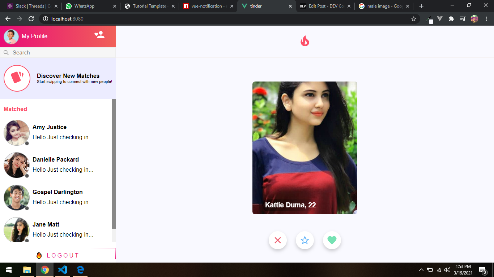
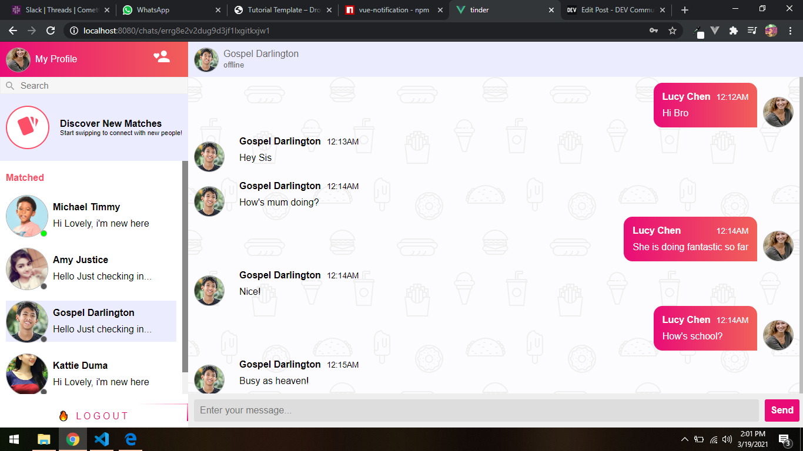
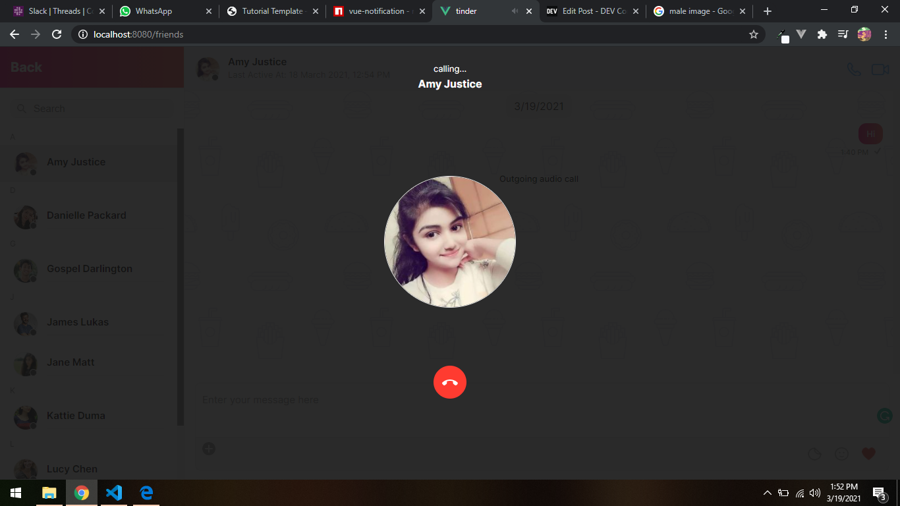

# Dating Site (Tinder Clone)

Read the full tutorial here:

[**>> How to Build a Dating Site with VueJs (Tinder Clone)**](https://www.cometchat.com/tutorials/#)

This example shows How To Build a Dating site chat with VueJs:


<figcaption>Tinder Clone Login Screen</figcaption>



<figcaption>Tinder Clone Home Screen</figcaption>



<figcaption>Tinder Clone Chat Screen</figcaption>


<figcaption>Tinder Clone Call Screen</figcaption>


## Technology
This demo uses:

* CometChat Pro 2.2.1
* Firebase
* VueJs
* Vue swing
* Vue Material Design Icons

## Running the demo

To run the demo follow these steps:

1. [Head to CometChat Pro and create an account](https://www.cometchat.com/pro?utm_source=github&utm_medium=link&utm_campaign=NAMEOFREPO)
2. From the [dashboard](https://app.cometchat.com/signup?utm_source=github&utm_medium=link&utm_campaign=NAMEOFREPO), create a new app called "Chat Apps"
3. One created, click **Explore**
4. Go to the **API Keys** tab and click **Create API Key**
5. Create an API key called "Tinder Clone" with **Full Access**
6. Get the VueJs CLI installed on your machine by entering this command on your terminal.
  ```sh
  npm install -g @vue/cli
  ```
7. Download the repository [here](https://github.com/daltonic/tinder-clone/archive/master.zip) or by running `git clone https://github.com/daltonic/tinder-clone.git` and open it in a code editor.
8. [Head to Firebase and create a new project](https://console.firebase.google.com)
9. Create a ".env" file in the root directory of the project.
10. Enter your secret keys from cometChat and Firebase in this manner.
  ```sh
    VUE_APP_ID="xxx-xxx-xxx"
    VUE_APP_KEY="xxx-xxx-xxx-xxx-xxx-xxx-xxx-xxx"
    VUE_APP_REGION="xx"

    VUE_APP_BASE_APIKEY="xxx-xxx-xxx-xxx-xxx-xxx-xxx-xxx"
    VUE_APP_BASE_AUTHDOMAIN="xxx-xxx-xxx-xxx-xxx-xxx"
    VUE_APP_BASE_PROJECTID="xxx-xxx-xxx"
    VUE_APP_BASE_STORAGEBUCKET="xxx-xxx-xxx-xxx-xx"
    VUE_APP_BASE_MESSAGINGSENDERID="xxx-xxx-xxx"
    VUE_APP_BASE_APPID="xxx-xxx-xxx-xxx-xxx-xxx"
    VUE_APP_BASE_MEASUREMENTID="xxx-xxx-xxx"

  ```
11. Duplicate ".env" file and rename to ".env.production".
12. Exclude ".env" and ".env.production" in the ".gitignore" file from being exposed on github.
  ```json
  # local env files
  .env.local
  .env.*.local
  ```
13. Run this command to install all dependencies.
  ```sh
  npm install
  ```
14. Run the app and register a new account.

Questions about running the demo? [Open an issue](https://github.com/daltonic/tinder-clone/issues). We're here to help ✌️


## Useful links

- 🏠 [CometChat Homepage](https://www.cometchat.com/pro/?utm_source=github&utm_medium=link&utm_campaign=NAMEOFREPO)
- 🚀 [Create your free account](https://app.cometchat.com/signup/?utm_source=github&utm_medium=link&utm_campaign=NAMEOFREPO)
- 📚 [Documentation](https://prodocs.cometchat.com/?utm_source=github&utm_medium=link&utm_campaign=NAMEOFREPO)
- 👾 [GitHub](https://www.github.com/cometchat-pro)
- 🔥 [Firebase](https://console.firebase.google.com)
- 🔷 [VueJs](https://vuejs.org/v2/guide/installation.html)
- 🔶 [Vue swing](https://www.npmjs.com/package/vue-swing)
- 💠 [Vue Material Design Icons](https://www.npmjs.com/package/vue-material-design-icons)
- ✨ [Live Demo](https://tiner-clone-213ab.web.app/)